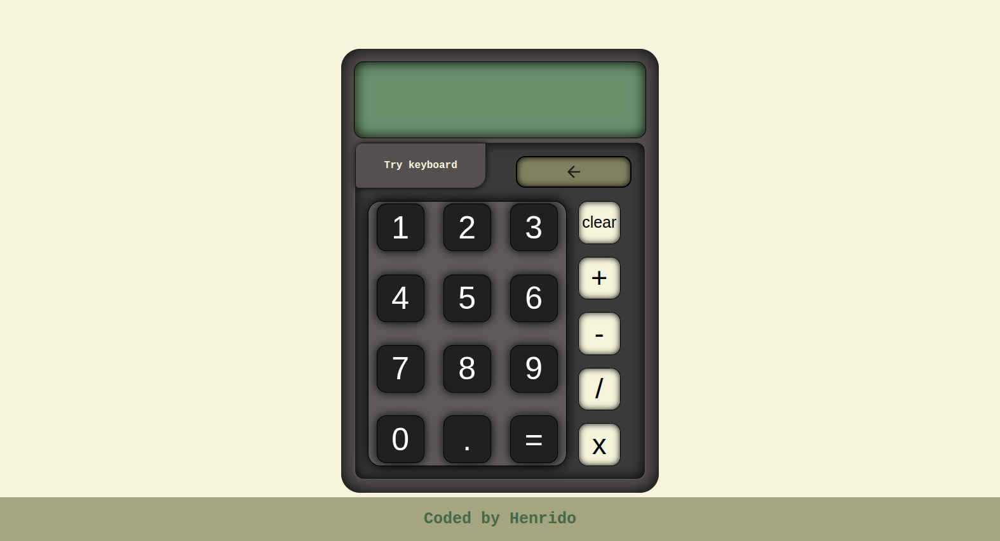

Overview:

My solution to the calculator project from TOP.

Screenshot:

Thoughts?

I practiced and learned a lot of javascript fundamentals during the creation of this solution.
I also revisited a lot of methods that didn't stick to my memory from previous lessons so in other words i found this project really helpful for practising javascript fundamentals.